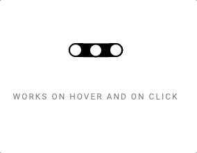

# Demo of exporting Adobe AfterEffects animation into SVG.

## Steps

1. Export json files from Adobe AfterEffects (here it is buttons.json)

2. Install the open-source lottie HTML player. This can be done by either serving a script up from here: https://cdnjs.com/libraries/bodymovin OR getting it directly from Adobe AE (click Get Player to download the file)

3. Add the JS snippet in index.js

## Demo

